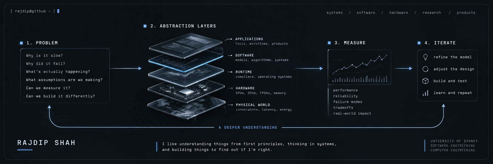

<p align="center">
  
</p>

<div align="center">

# Rajdip Shah

</div>


**I like understanding things from first principles, thinking in systems, and building things to find out if I'm right.**

Software Engineering @ University of Sydney · Computer Engineering specialisation

`systems` · `machine learning` · `computer architecture` · `performance` · `research`

<br clear="right">

```text
> whoami

I'm interested in problems where the obvious solution isn't good enough.

What would make this possible?
What is preventing the current system from doing it?
What architecture, algorithm, or systems-level change would unlock it?
What tradeoffs does that introduce?
Can we build it and make it actually work?
```

I like starting from a hard goal or constraint, understanding the parts of the existing system that actually matter, and designing the change that makes the goal achievable.

Sometimes that means building a new architecture from scratch. More often, it means extending an existing one in a way that unlocks a capability it couldn't support before.

The interesting part for me is the **solution design**: figuring out the architecture, algorithm, representation, or systems-level tradeoff that turns something difficult into something buildable — and then implementing it.

Most of what I'm exploring sits somewhere between **software, systems, and the machine underneath** — from ML systems and performance to computer architecture, FPGA/RTL, and formal methods.

I'm still figuring out where I want to go deepest.

That's half the fun.


<br>

### `~/right-now`

```text
learning   → machine learning from the fundamentals up
research   → formal specifications × AI-generated software
building   → tools · systems · experiments · products
going low  → computer architecture · FPGA · systems programming
designing  → architectures · algorithms · hard constraints · tradeoffs
```

<br>

```text
first principles  →  understand the real constraints before choosing a solution
systems thinking  →  understand which interactions actually determine what is possible
architecture      →  design the structure that makes the goal achievable
experimentation   →  test whether the idea survives contact with reality
engineering       →  build the damn thing
```

<div align="center">

### ↓ things I've built, broken, rebuilt, and learned from ↓

</div>
